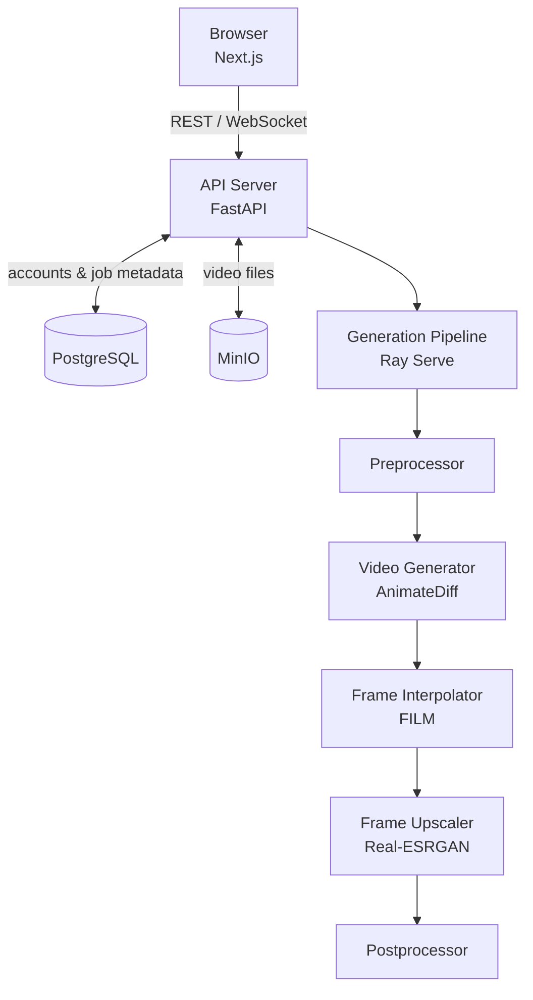

# AuraAnim

<div align="center">
  
</div>

AuraAnim is a scalable text-to-video generation system that transforms natural language prompts into short videos. Developed as part of a Bachelor's Thesis in Computer Science, the project focuses on making diffusion-based video generation work on consumer-grade hardware.

## What the project does
AuraAnim is a web application allowing its users to queue several videos for generation and to view the results in a gallery with dynamic previews. Under the hood, a distributed pipeline runs a Stable Diffusion-based model ([AnimateDiff](https://github.com/guoyww/AnimateDiff)), optionally sharpens motion with neural frame interpolation ([FILM](https://github.com/google-research/frame-interpolation)), and upscales frames to the requested resolution ([Real-ESRGAN](https://github.com/xinntao/Real-ESRGAN)), all within a containerized environment.

The system exposes a Web UI with real-time generation progress over WebSocket, user accounts, a video gallery, and both a simple and an advanced parameter mode for controlling the generation process.

<div align="center">
  
  <p><em>Prompt: "A corgi walking on the street, cinematic"</em></p>
</div>

## Architecture



The generation pipeline is deployed as a sequence of independent Ray Serve deployments, which allows CPU-bound steps (pre/postprocessing) and GPU-bound steps (generation, interpolation, upscaling) to scale separately. The API server is stateless, relying on JWT tokens and the database for all session state, which makes horizontal scaling straightforward.

## Running on consumer hardware

The pipeline was developed and benchmarked on an NVIDIA RTX 4070 Super (12 GB VRAM). Two design decisions were central to making higher resolutions and frame rates feasible on this hardware.

**Generate at low resolution, then upscale.** VRAM usage grows steeply with frame resolution due to the overhead of the underlying model - doubling resolution increases VRAM requirements by roughly 3-4x, making direct high-resolution generation impractical. Direct 1024x1024 generation took approximately one hour for a 5-second clip and ran out of memory at 6 seconds. Instead, the Video Generator produces frames at 512x512 and the Frame Upscaler uses Real-ESRGAN to reach the target resolution. This brings 1024x1024 output down to 45-125 seconds and yields a 15-30x speedup for longer clips compared to direct generation.

**Generate at 8 FPS, then interpolate.** Generating at a high frame rate multiplies VRAM requirements linearly with frame count. The generator therefore operates at a fixed 8 FPS base rate, and FILM synthesizes intermediate frames to reach the requested frame rate. At 24 FPS output this produces roughly a 10x speedup over generating all frames through diffusion (80-280 s vs. 120-2750 s across 2-6 second clips).

Benchmarked end-to-end generation times at 8 FPS base rate:

| Resolution | 2 s clip | 6 s clip |
|---|---|---|
| 256x256 | ~18 s | ~37 s |
| 512x512 | ~38 s | ~110 s |
| 1024x1024 | ~45 s | ~125 s |
| 2048x2048 | ~55 s | ~170 s |

## CUDA WSL2 setup guide
In order to run CUDA-enabled containers on Windows the following dependencies are necessary:
- new NVIDIA drivers installed on **Windows**
- CUDA toolkit installed on WSL2 Ubuntu: [CUDA Downloads (WSL-Ubuntu)](https://developer.nvidia.com/cuda-downloads?target_os=Linux&target_arch=x86_64&Distribution=WSL-Ubuntu&target_version=2.0&target_type=deb_local)
- [NVIDIA Container Toolkit](https://docs.nvidia.com/datacenter/cloud-native/container-toolkit/1.13.5/install-guide.html) - follow the *Docker* section

The dependencies should be installed in the order given above. To check if everything was installed correctly execute ```sudo docker run --rm --runtime=nvidia --gpus all nvidia/cuda:11.6.2-base-ubuntu20.04 nvidia-smi```

Now, to build the image and run a container go to the backend directory and run ```docker build -t text-to-video-backend .```. To start a container from the image with GPU support run ```docker run --gpus all -p 8000:8000 -p 8265:8265 text-to-video-backend```.

## Running using Docker Compose
To run the development version of the application together with supporting containers execute
```docker compose -f docker-compose.dev.yaml up --build``` from the ```docker``` directory.

## Database management
Adminer is included in the development Docker Compose setup for easy database inspection.

### Accessing Adminer
1. Make sure the development containers are running:
```bash
cd docker
docker compose -f docker-compose.dev.yaml up
```
2. Open your browser and navigate to: **http://localhost:8080**
3. Log in with the following credentials:
- **System:** `PostgreSQL`
- **Server:** `postgres-dev`
- **Username:** `dev_user`
- **Password:** `dev_password`
- **Database:** `text_to_video_dev`

## Object Storage Management
MinIO Console is included in the development Docker Compose setup for managing video storage.

### Accessing MinIO
1. Make sure the development containers are running:
```bash
cd docker
docker compose -f docker-compose.dev.yaml up
```
2. Open your browser and navigate to: **http://localhost:9001**
3. Log in with the following credentials:
- **Username:** `minio_admin`
- **Password:** `minio_pass123`
